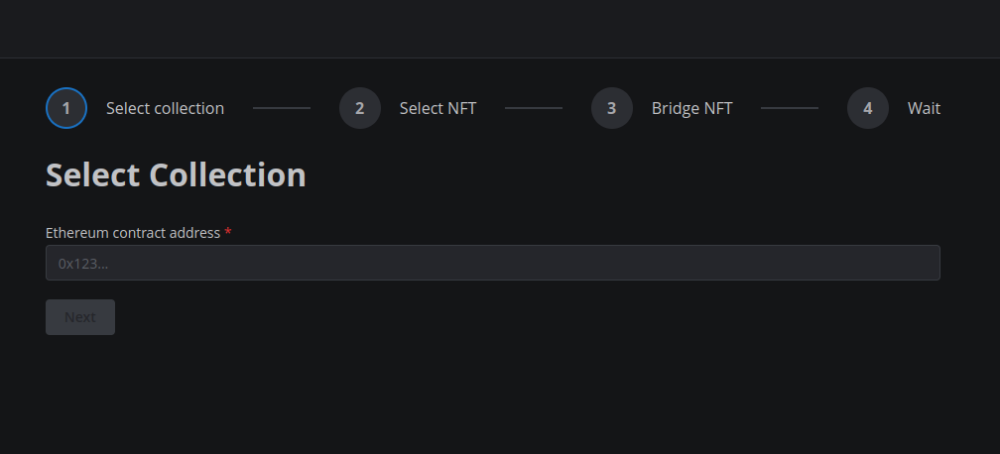
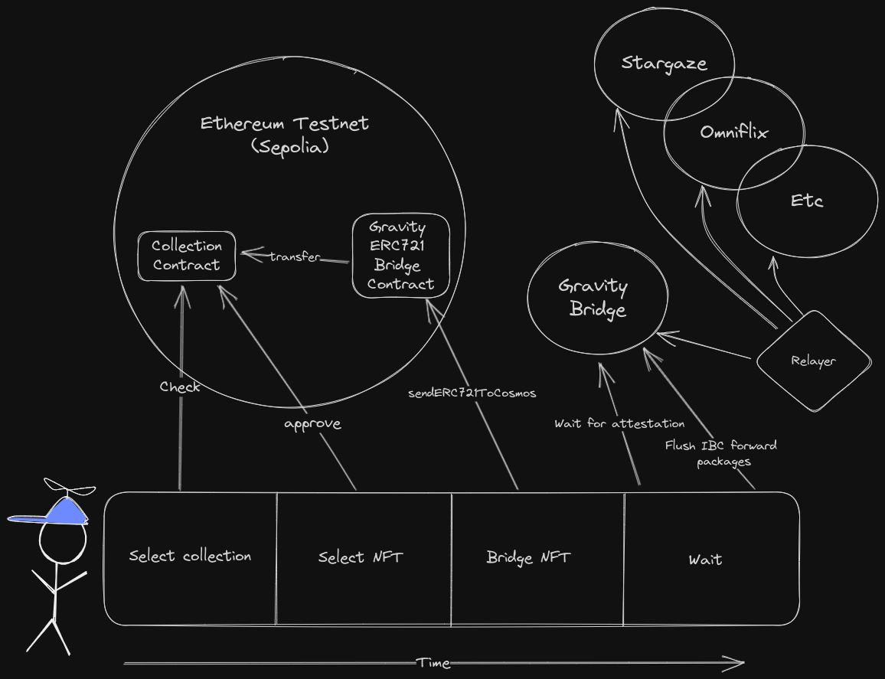

# Gravity NFT UI

The Gravity NFT UI is a fairly simple demo application that allows users to bridge NFTs from 
Ethereum (Sepolia) to the Cosmos ecosystem (not back though) using the gravity bridge hackathon
version that supports ERC721: https://github.com/EmpowerPlastic/Gravity-Bridge/tree/game-of-nfts-stargaze

The gravity bridge setup we have right now supports bridging NFTs from Ethereum testnet Sepolia to:
- Stargaze
- Omniflix

Adding support for more chains should be fairly easy once we make some fixes and adjustment on the bridge itself 
(see the hackathon readme in the bridge repo for more info).



The UI is not made to be production-ready or to be very easy to use, the point was to have a 
simple UI that showcases the functionality of the bridge in a relatively easy to understand way.

It does (in order of appearance):
- Select collection (by writing in Ethereum NFT contract address)
  - The frontend does some basic checking to see if the contract is an ERC721 contract
- Select NFT (by writing in NFT ID)
- Approve NFT for transfer (Ethereum transaction)
- Transfer NFT to bridge contract (Ethereum transaction)
- Wait for Gravity Bridge to pick up the NFT
- Flush the ERC721 forwarding queue (Cosmos/GB transaction)



## gravityjs

In the gravity bridge repo we also made a telescope-based JS library that makes it easier to interact with the bridge.
It generates types and clients for Gravity Bridge based on protobuf definitions.

For simplicity, we just copied the generated code into this repo (see `src/web3/gravityjs`).

## Future work

In its current stage the frontend is a bit rough around the edges and could use some improvements:
- Better error handling
- Better loading indicators
- Better UI/UX in general (explain stuff better, make it more intuitive, etc.)
- Show the user where the NFT actually ended up (e.g. Class denom, contract address on Stargaze, etc)
- Save state in local storage to:
  - Pick up where the user left off if refresh or coming back
  - Show recent history?

In terms of features that would be useful here:
- A "my page" of sorts where the user can see their assets
  - On the ethereum side
  - On the cosmos side
- Transfer back to Ethereum (not supported in the hackathon version of the bridge)
- History of transfers

## Development
This is a [Next.js](https://nextjs.org/) project bootstrapped with [`create-next-app`](https://github.com/vercel/next.js/tree/canary/packages/create-next-app).

First, run the development server:

```bash
npm run dev
# or
yarn dev
# or
pnpm dev
```

Open [http://localhost:3000](http://localhost:3000) with your browser to see the result.